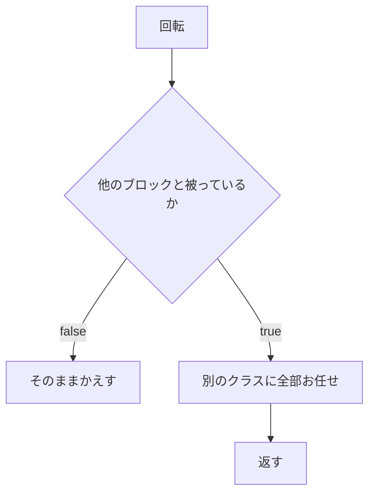

# 被りに関するいろいろ
Rotate.jsは回転に関することだけにしたいので､被り関係は別のファイルにする

# 変更
## 引数
### cloneField -> field
ディープコピーしたcloneFieldを受けとっているが､ディープコピーする作業は
関数の内側でやるようにして､受け取る引数はfieldにする

### coordinate -> tetrimino
処理の途中でタイプを参照する､tetriminoクラスの関数を使うので丸ごと必要になった｡
途中でいじるので関数内でクローンを作る

# rotate.jsから見た全体図
