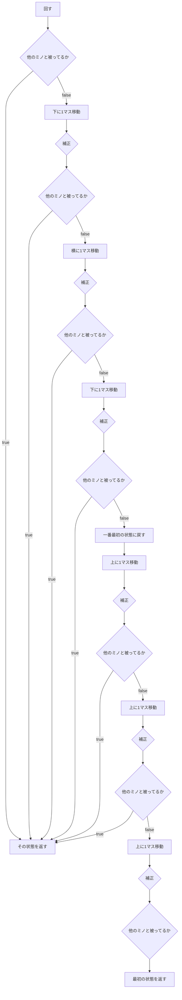
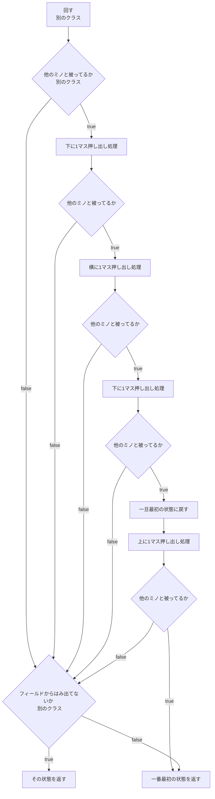

まずは考えなどを1度整理する必要がある

# L,J,T,Iの場合の全体の流れ
## 提案1
階段になってるフローチャートをスッキリさせる技があった気がするんだけどな｡

いくつか関数としてまとめられそう  
成功したか失敗したか判断が必要だから
{status:boolean,coordinate:array}

下に動くのと､上に動かすのは別々にする

## 提案2

階段になってるフローチャートをスッキリさせる技があった気がするんだけどな｡

# 回転入れ
下->横->下  
の順でやればL,J,T,Iは解決する  

ただ,S,Zは下に2回やる方法でないといけない｡  
-> タイプで動きを分けることにしよう｡  

## 横に動かすについて
色々試したろころ  
反時計回転したら**右に**  
時計回転したら**左に**  
で大丈夫だと思う

# クラス名どうしよう
gptにも色々相談してみよう  
回転入れ<-これが一番適切か?  
押出  
被っているかどうかという部分を別に取り出して｡この回転入れという個別クラスを作るてもある  
回転入れシミュレーター  

## 何をするクラスか  
被っているかどうか判断  
被っていた時の処理(メイン)  
回転入れができなかった時の処理  

## 何が目的か
回転入れを実現させる?

# 作る関数

